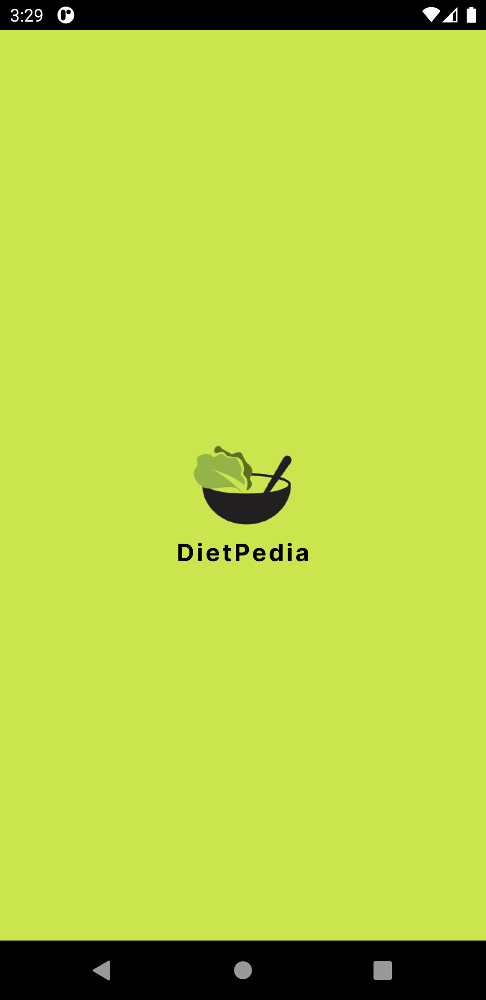
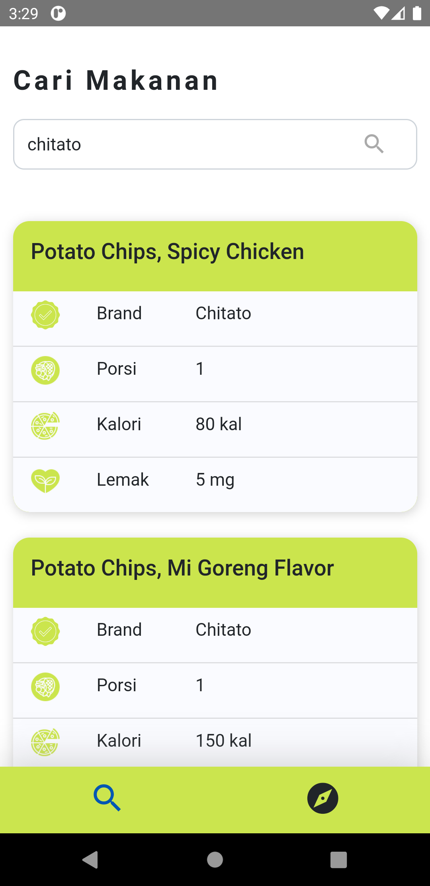
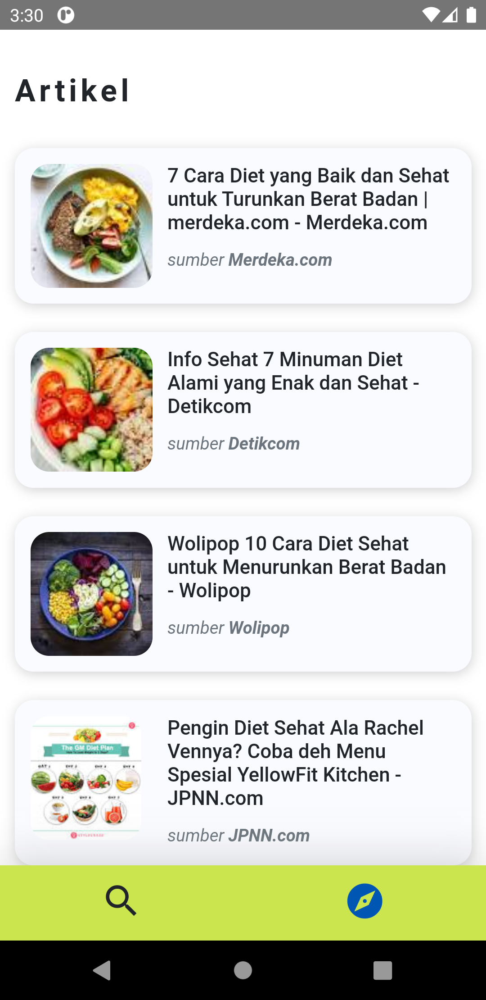

# Dietpedia Apps #
Aplikasi untuk referensi diet berbasis Android

# InApp #
- `Welcome Screen`

  - 

- `Search Menu`

  - 

- `Article Menu`

  - 

# Installation #

Go to [Release Page](https://github.com/riskids/dietpedia-AndroidApp/releases/tag/v1.0.0), download the apk then install from you android phone

# Source #

This app build on WebView, load a website that using react.js. Go to [Dietpedia SourceCode](https://github.com/riskids/Dietpedia-SourceCode) to see source code
